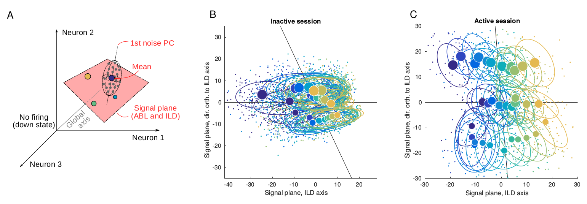

# State-dependent geometry of population activity in rat auditory cortex

Analysis code and spike count data for our paper [State-dependent geometry of population activity in rat auditory cortex](https://elifesciences.org/articles/44526) (eLife, 2019).

* Paper: https://elifesciences.org/articles/44526  
* Preprint: https://www.biorxiv.org/content/10.1101/501338v2

-----------------------------

The spike count data are located in the `spicounts` folder. Each file corresponds to one experimental session. Columns correspond to neurons and the first row encodes the shank from which this neuron was recorded. The first six columns of the remaining rows are: (1) session id after splitting some of the sessions (some experimental sessions were split in two based on the activation level, see paper); (2) CV of the [splitted] session; (3) trial number; (4) ABL; (5) ILD; (6) center of the 50 ms spike count window relative to the sound onset.

Run `preprocessSpikecounts.m` to produce `evokedResponses.mat` that is used by all other scripts. The `preprocess.m` script loads the original spiking data (not shared here) and also produces `evokedResponses.mat`. 

The decoding analysis is done in the `runDecoding.m` and takes some hours. The resulting performance metrics are saved into `decoding_results.mat` directly available in this repository.

Each figure is produced by the corresponding `figure[...].m` script.

